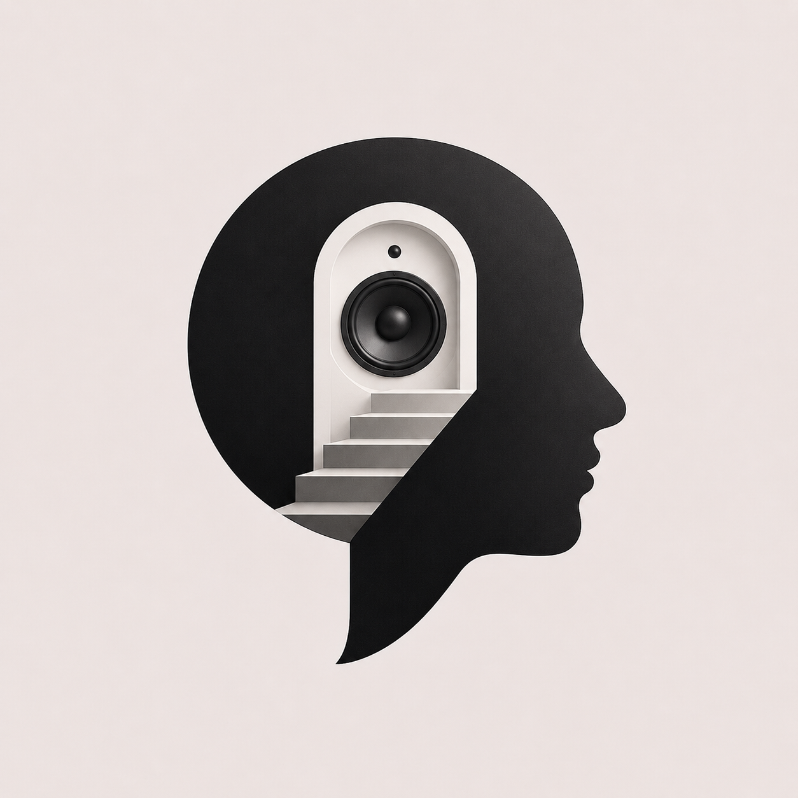

<p align="center">
  
</p>

<p align="center">
  <a href="https://demo-ten-ochre-18.vercel.app"></a>
  <a href="https://github.com/Mani212005/Bolo"></a>
</p>

# Bolo: Open-Source Voice Dictation for macOS & Linux

Fast, private voice dictation and speech-to-text for macOS and Linux. An open-source alternative to Wispr Flow and Superwhisper with on-device local Whisper and ultra-fast Groq Whisper STT.

Press a global hotkey, speak naturally, and high-accuracy transcribed text appears directly at your cursor in any application.


https://github.com/user-attachments/assets/4111acdf-83bc-4493-a096-9a30876a1bbb


---

## Bolo vs. Wispr Flow vs. Superwhisper

| Feature | Bolo | Wispr Flow | Superwhisper |
|---|---|---|---|
| **License & Price** | **100% Free & Open Source (MIT)** | Paid subscription ($12+/mo) | Paid subscription ($8+/mo) |
| **Privacy & Local STT** | **Yes** (whisper.cpp & faster-whisper) | No (Cloud only) | Yes (Local models) |
| **Ultra-Fast Cloud STT** | **Yes** (Groq Whisper in ~250ms) | Yes (Proprietary cloud) | Yes (Cloud credits) |
| **Linux Support** | **Yes** (Wayland & X11) | No (macOS & Windows only) | No (macOS only) |
| **macOS Support** | **Yes** (Native Cocoa & Apple Silicon) | Yes | Yes |
| **Mid-Speech Clipboard Splice** | **Yes** (`Option+V` without stopping) | No | No |
| **Audio Playback & History** | **Yes** (Built-in playback engine) | Limited | Limited |
| **AI Prompt Enhancement** | **Yes** (Groq LLaMA-3.3-70B) | Yes | Yes (Paid tier) |
| **Custom Vocabulary Biasing** | **Yes** (Plain text & UI chips) | Yes | Yes |
| **Interactive Web Demo** | **Yes** (Vercel-ready browser demo) | No | No |

---

## Features

- **Global Push-to-Talk Hotkey**: Press `Ctrl + Space` anywhere to start and stop speech-to-text dictation at your cursor.
- **Mid-Dictation Clipboard Splicing**: Press `Option + V` mid-speech to insert links, code, or copied text without pausing audio.
- **On-Device Privacy & Local Models**: Run speech recognition completely offline with whisper.cpp and faster-whisper.
- **Ultra-Fast Cloud Transcription**: Transcribe long voice notes in ~250ms using Groq Whisper-Large-v3.
- **Recording Pill (macOS)**: A small always-on-top pill at the bottom of the screen shows a live mic waveform while Bolo records, a moving wave while it transcribes, and a check when the text lands. Click it to start, stop or resume; drag it anywhere; right-click it to switch style, show or hide the idle handle, or open the dashboard. Pick **Small**, **Large** (bigger waveform, timer, Pause/Resume and Stop buttons) or **Hidden** in the dashboard's *Recording indicator* card, with `bolo pill-style`, or from the pill's menu; it applies at once. It never takes focus from the app you dictate into, stays out of screenshots and screen sharing, and honours Reduce Motion and VoiceOver.
- **Native Popup & History Dashboard**: Search past voice dictations, filter image-bearing transcriptions, and listen back with the built-in audio playback engine.
- **Screen Context Lightbox & Bulk Image Copy**: Browse captured screenshots with an always-visible per-card images section, expand images in a full-screen modal, and copy single screenshots or all transcription images directly to your clipboard.
- **One-Click AI Prompt Enhancement**: Refine raw speech and rambles into structured prompts using LLaMA-3.3-70B with settings-configurable models and API keys.
- **Real-Time Jev Semantic Formatting & Smart Code**: Automatically classifies code vs prose and tags programming languages (```` ```rust ````, ```` ```python ````) and layers lists/paragraphs using the sub-400ms Jev decision engine with heuristic fallback.
- **Custom Vocabulary Biasing**: Add technical terms, proper nouns, and acronyms for accurate phonetic transcription.
- **Audio File Drag and Drop**: Drop any audio file directly into the dashboard for immediate speech-to-text transcription.
- **Circle-to-Capture Screen Context**: Hover pointer in a circle (hover only, do not click or press) during dictation to capture and attach screenshots of relevant UI or code.
- **Browser Web Demo & Launch Page**: Try Bolo online via the hosted launch page and interactive speech playground (`demo/`).

---

## Global Shortcuts

| Shortcut (macOS) | Shortcut (Linux) | Action |
|---|---|---|
| `Ctrl + Space` | `Ctrl + Space` | **Start / Stop Dictation**: Pastes text at cursor and copies to clipboard |
| `Option + V` (`⌥V`) | `Alt + V` | **Quick-Splice Clipboard**: Injects clipboard text mid-speech without stopping audio |
| `Option + P` (`⌥P`) | `Alt + P` | **Pause / Resume**: Temporarily freezes ongoing voice recording |
| `Option + I` (`⌥I`) | `Alt + I` | **Re-Type Last**: Types the most recent transcription at cursor position |
| `Option + C` (`⌥C`) | `Alt + C` | **Copy Selection & Splice**: Copies selected text from frontmost app and splices |

---

## Quickstart & Installation

One command installs dependencies, compiles native binaries, and sets up the background daemon:

```bash
git clone https://github.com/Mani212005/Bolo.git
cd Bolo
./install.sh
```

### 1. Launch

```bash
bolo
```

*Running `bolo` makes sure the background daemon is running (which shows the recording pill on macOS); it opens no window. Run `bolo settings` for the dashboard and `bolo exit` to shut down.*

On macOS the daemon also starts `bolo-pill` (built and installed next to `bolo` by `install.sh`): the small recording pill described above. It is optional; without the helper (`bolo` tells you how to install it), with `bolo pill-style hidden`, and on Linux, Bolo keeps the start chime and its "Listening / Paused / Transcribing" notification banners. While the pill is showing, those three banners are skipped as redundant; result and error banners always stay. If you hide the pill from its own menu, bring it back with `bolo pill-style small` or the dashboard.

### 2. macOS Permissions (One-Time Setup)

Grant the following permissions in **System Settings > Privacy & Security**:
- **Microphone**: For voice dictation audio capture.
- **Accessibility**: To paste transcribed text directly at your cursor (`Cmd+V`).
- **Input Monitoring**: For global push-to-talk hotkeys (`Ctrl+Space`).

### 3. Linux Integration

On Linux, `install.sh` configures your systemd user service, GNOME hotkeys, and XDG Desktop Portals for Wayland and X11. Access the web dashboard at `http://127.0.0.1:4525` or via `bolo settings`.

---

## CLI Commands

```bash
bolo                     # Start the daemon (and the recording pill on macOS); no window
bolo settings            # Open the settings & history dashboard (also: ui, history)
bolo pill-style large    # Recording pill style: small, large or hidden (live)
bolo pill-idle off       # Hide or show the tiny idle handle (live)
bolo exit                # Cleanly terminate daemon, pill and dashboard window
bolo daemon              # Run background engine in foreground for logs
bolo toggle              # Toggle voice dictation start / stop
bolo quick-splice        # Splice clipboard into ongoing recording
bolo pause               # Pause or resume ongoing voice recording
bolo insert-last         # Re-type the most recent transcript at cursor
bolo enhance             # Enhance the last transcript with AI
bolo transcribe <file>   # Transcribe a local audio WAV file
bolo events              # Print the live event stream (phase, mic level, outcome) as JSON lines
bolo eval-format         # Score code detection on labeled cases (--jev compares Jev)
bolo split-preview       # Read text on stdin, print terminal paste pieces as JSON
```

---

## Configuration

Bolo configuration files live in `~/.config/bolo/`:

- **`~/.config/bolo/config.toml`**: Speech engine, models, hotkeys, and VAD parameters.
  ```toml
  [stt]
  provider = "faster-whisper" # "faster-whisper", "whisper", or "groq"

  [stt.whisper]
  model = "small.en"          # "tiny.en", "base.en", "small.en", "large-v3-turbo"

  [groq]
  model = "whisper-large-v3"
  language = "en"
  temperature = 0.0

  [vad]
  auto_endpoint = false       # false = manual push-to-talk toggle
  max_utterance_ms = 1800000  # 30-minute maximum recording cap

  [vision]
  enabled = true              # hover pointer in a circle to capture screen context
  min_angle_degrees = 315.0   # minimum circle arc angle threshold

  [pill]
  style = "small"             # macOS recording pill: "small", "large" or "hidden"
  show_when_idle = true       # tiny handle on screen while idle; click it to dictate

  [formatting]
  smart_code = true           # fallback heuristic wrapping code in markdown backticks

  [formatting.jev]
  enabled = true              # real-time semantic predictive formatting via Jev
  # provider = "typesafe"    # "typesafe" (default) or "openrouter"; inferred from the key when unset
  # model = "jev-latest"     # empty = provider default
  timeout_ms = 2500           # async decision timeout (cleanly falls back if exceeded)
  # api_key = "..."          # optional: config, else TYPESAFE_API_KEY / OPENROUTER_API_KEY from env or ~/.env
  ```

- **`~/.config/bolo/vocabulary.txt`**: Custom word prompts (names, brand terms, acronyms).
- **`~/.config/bolo/enhance_prompt.txt`**: Prompt template for AI enhancement.
- **`~/.env`**: Optional `GROQ_API_KEY=gsk_...` and `TYPESAFE_API_KEY=...` (or `OPENROUTER_API_KEY=sk-or-...`) for cloud transcription, LLaMA enhancement, and Jev formatting decisions.

---

## Dictating into terminal agents

Terminal agents such as Claude Code and Antigravity (`agy`) collapse a large paste into a placeholder like `[Pasted text #1 +4 lines]`, so you cannot see or fix what you dictated. On macOS, when the frontmost app is a terminal (Terminal, iTerm2, WezTerm, Ghostty, kitty, Alacritty, Warp, Hyper, Tabby, Termius), Bolo pastes the dictation as several small pastes instead of one. Each piece stays under the agents' collapse limits, so every word shows. Paragraph breaks are kept, the clipboard is saved once before the first piece and restored once after the last, and other apps still get a single paste.

- **Interrupted pastes:** if you switch apps mid-paste, Bolo stops and tells you how many parts landed. If you copy something new mid-paste, Bolo stops and keeps your copy. `bolo insert-last` (Alt+I) inserts the whole dictation again.
- **Screenshots:** each screenshot path is its own paste. Claude Code turns a paste that is only an image path into an attached image (`[Image #1]`); `agy` keeps the quoted path as text.
- **Long dictations:** one that needs more than `max_pieces` (40) pieces is pasted once, and the agent shows a placeholder.
- **Built-in terminals in an IDE:** VS Code, Cursor, Zed and JetBrains look like the IDE to Bolo, not a terminal, so they keep a single paste. To split there, add the IDE to `extra_apps`.

```toml
[inject.terminal]
split_paste = true          # false = always one paste
max_paste_chars = 800       # per piece, UTF-16 units (Claude Code collapses above 800, agy above 1000)
max_paste_newlines = 2      # line breaks per piece (Claude Code collapses above 2)
settle_ms = 50              # pause between pieces; raise to 100 if a piece is ever lost or doubled
max_pieces = 40             # above this, paste once
extra_apps = ["com.microsoft.VSCode"]  # also split in these apps (name or bundle id substring)
exclude_apps = []           # never split in these apps; wins over everything
```

`bolo split-preview` reads text on stdin and prints the pieces as a JSON array. `scripts/paste-e2e/paste_e2e.py` checks the pieces against the installed Claude Code and `agy` in a private tmux server (it never submits a prompt).

---

## Architecture

```
+-------------------------------------------------------------+
|                    macOS / Linux Desktop                    |
|   (Any App: VS Code, Slack, Browser, Terminal, Notes)       |
+------------------------------+------------------------------+
                               |
            +------------------+------------------+
            |                                     |
            v                                     v
   [ Native Hotkey Engine ]              [ Native Popup UI ]
    * macOS: CGEventTap / Carbon          * Swift Cocoa + WebKit (Mac)
    * Linux: Desktop Portal Keybind       * Web Dashboard (Linux)
            |                                     |
            +------------------+------------------+
                               v
                    [ Bolo Core Daemon ]
                 * Audio Stream (16kHz cpal)
                 * Silero VAD (Speech Detection)
                 * Mid-Speech Splicing Engine
                 * WAV Capture Storage
                 * Event stream -> bolo-pill (macOS recording pill)
                               |
            +------------------+------------------+
            |                                     |
            v                                     v
   [ Local Private STT ]                 [ Cloud Fast STT ]
    * faster-whisper (CTranslate2)        * Groq Whisper-Large-v3
    * whisper.cpp (Metal/CPU)             * ~250ms ultra-low latency
            |                                     |
            +------------------+------------------+
                               v
                   [ Injector & Clipboard ]
                 * Native macOS Quartz Keystrokes
                 * Linux Wayland Portal / X11
```

---

## License

[MIT License](LICENSE). Free and open source.
